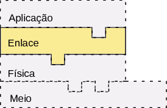

# Projeto 3 : HandShake / Ack, Nack e Syn

O intuito desta etapa do projeto é incrementar um protocolo de comunicação handshake. A comunicção handshake entre um cliente e um servidor consiste na troca prévia de pequenos pacotes entre ambos a fim de estabelecerem uma comunicação mais estável para a transmissão do pacote, verificando se os dois pontos estão aptos para a transmissão.
